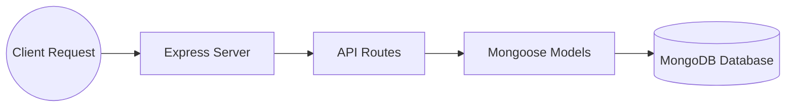

# Suntech Assignments - Week 3: Modular E-Commerce Backend API System

Welcome to the documentation for the Week 3 Assignment.  
This project demonstrates a complete **E-Commerce Backend API System** built using:

- Node.js
- Express.js
- MongoDB
- Mongoose
- ES6 Modules

The application simulates how real-world backend systems manage:

- User Registration
- Product Management
- Shopping Cart Operations
- Database Integration
- Password Hashing
- REST API Architecture

---

#  Project Folder Structure

```text
Week-3-Sample-Ecomm-Demo/
├── APIs/
│   ├── prodAPI.js            # Product API Routes
│   └── userAPI.js            # User & Cart API Routes
│
├── Models/
│   ├── ProductModel.js       # Product Schema & Model
│   └── UserModel.js          # User Schema & Cart Schema
│
├── node_modules/
├── .gitignore
├── package.json
├── package-lock.json
├── req.http                  # API Testing Requests
└── server.js                 # Main Server Entry Point
```

---

#  Backend Architecture



---

# ⚙️ Module Breakdown

---

# 1️⃣ Server Bootstrapper (`server.js`)

Acts as the main entry point of the application.

### Responsibilities

- Initializes Express server
- Connects MongoDB database
- Registers middleware
- Connects API routes
- Handles global errors

### MongoDB Connection

```javascript
await connect("mongodb://localhost:27017/ecom");
```

### Route Registration

```javascript
app.use("/users", userRoute)
app.use("/products", productRoute)
```

---

# 2️⃣ Product Schema Layer (`ProductModel.js`)

Defines the MongoDB schema for storing products.

## Product Schema Fields

| Field | Type | Validation |
|---|---|---|
| productName | String | Required |
| price | Number | Required |
| brand | String | Required |

---

## Features

- Required field validation
- Minimum price validation
- Strict schema enforcement
- Automatic timestamps

---

## Example Product Object

```json
{
  "productName": "Laptop",
  "price": 50000,
  "brand": "HP"
}
```

---

# 3️⃣ User & Cart Schema Layer (`UserModel.js`)

Defines user details and shopping cart structure.

---

## User Schema Fields

| Field | Type |
|---|---|
| username | String |
| email | String |
| password | String |
| cart | Array |

---

## Embedded Cart Schema

```javascript
cart: [
  {
    product: ObjectId,
    quantity: Number
  }
]
```

---

## Features

- Username validation
- Unique email validation
- Embedded cart management
- Product population using Mongoose references

---

# 4️⃣ Product API Layer (`prodAPI.js`)

Handles all product-related operations.

---

## Available APIs

### Get All Products

```http
GET /products/product
```

Returns all products from MongoDB.

---

### Add Product

```http
POST /products/add
```

Creates a new product.

### Example Request Body

```json
{
  "productName": "Phone",
  "price": 30000,
  "brand": "Samsung"
}
```

---

# 5️⃣ User API Layer (`userAPI.js`)

Handles user operations and cart management.

---

#  User APIs

---

## Get All Users

```http
GET /users/users
```

---

## Get User By ID

```http
GET /users/users/:id
```

---

## Register User

```http
POST /users/register
```

### Features

- Request validation
- Password hashing using bcryptjs
- Secure password storage

### Password Hashing Logic

```javascript
let hashedPassword = await hash(newUser.password, 6);
```

---

#  Cart Management APIs

---

## Add Product to Cart

```http
PUT /users/user-cart/:uid/:pid
```

### Cart Logic

- Verifies user existence
- Verifies product existence
- Increases quantity if product already exists
- Adds new product otherwise

### Quantity Increment Logic

```javascript
if (index !== -1) {
    user.cart[index].quantity += 1;
}
```

---

## Fetch User Cart

```http
GET /users/users/:uid
```

Uses `.populate()` to retrieve product details dynamically.

---

## Compare Product in Cart

```http
GET /users/compare/:uid/:pid
```

Checks whether a product already exists inside the user's cart.

---

#  Complete Application Workflow

```text
1. Start Express Server
        ↓
2. Connect MongoDB Database
        ↓
3. Register User
        ↓
4. Add Products
        ↓
5. Fetch Products
        ↓
6. Add Product to Cart
        ↓
7. Increase Product Quantity
        ↓
8. Retrieve Updated Cart
        ↓
9. Compare Product Existence
```

---

#  Project Setup & Installation

---

## Step 1: Initialize Project

```bash
npm init -y
```

---

## Step 2: Install Dependencies

```bash
npm install express mongoose bcryptjs
```

---

## Step 3: Enable ES Modules

Inside `package.json`:

```json
{
  "type": "module"
}
```

---

## Step 4: Start MongoDB

Ensure MongoDB server is running locally.

---

## Step 5: Run Server

```bash
node server.js
```

---

#  Expected Console Output

```text
Connected to mongo
server listening on port 4000...
```

---

#  API Testing

You can test APIs using:

- Postman
- Thunder Client
- VS Code REST Client
- req.http file

---

#  Sample API Requests

---

## Register User

```http
POST http://localhost:4000/users/register
Content-Type: application/json

{
  "username": "ananya",
  "email": "ananya@gmail.com",
  "password": "123456"
}
```

---

## Add Product

```http
POST http://localhost:4000/products/add
Content-Type: application/json

{
  "productName": "Laptop",
  "price": 50000,
  "brand": "HP"
}
```

---

## Add Product to Cart

```http
PUT http://localhost:4000/users/user-cart/:uid/:pid
```

---

## Fetch User Cart

```http
GET http://localhost:4000/users/users/:uid
```

---

# Concepts Covered

This project demonstrates:

- REST API Development
- Express Routing
- MongoDB Integration
- Mongoose Models
- Schema Validation
- Password Hashing
- Cart Management Logic
- MongoDB Population
- Embedded Documents
- Modular Backend Architecture

