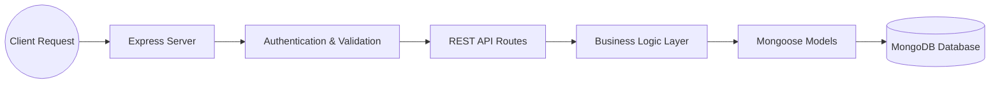

# Week 4-5: Full Stack Blog Application Backend

Welcome to the documentation for the Week 4 **Capstone Project Backend**.  
This project is a production-style **Blog Application Backend System** built using:

- Node.js
- Express.js
- MongoDB
- Mongoose
- JWT Authentication
- Cloudinary
- Multer
- Role-Based Authorization

The application demonstrates enterprise-level backend architecture including:

- Authentication & Authorization
- Role-Based Access Control
- Article Management
- Comments System
- Admin Controls
- Image Uploads
- Middleware Security
- Global Error Handling

---

#  Project Folder Structure

```text
Capstone_Project_Backend/
├── APIs/
│   ├── AdminAPI.js             # Admin operations & user blocking
│   ├── Author.API.js           # Author article management APIs
│   ├── CommonAPI.js            # Shared authentication APIs
│   └── UserAPI.js              # User article & comment APIs
│
├── config/
│   ├── cloudinary.js           # Cloudinary configuration
│   ├── cloudinaryUpload.js     # Cloudinary upload helper
│   └── multer.js               # Multer image upload configuration
│
├── middlewares/
│   ├── checkAuthor.js          # Author verification middleware
│   └── VerifyToken.js          # JWT verification middleware
│
├── Models/
│   ├── ArticleModel.js         # Article schema/model
│   └── UserModel.js            # User schema/model
│
├── services/
│   └── authService.js          # Authentication service layer
│
├── .env
├── package.json
├── req.http
└── server.js
```

---

#  Backend Architecture



---

#  Core Features

- JWT Authentication
- Role-Based Authorization
- Author Article CRUD
- User Comments System
- Admin User Blocking
- Cloudinary Image Uploads
- Secure Password Hashing
- Cookie-Based Authentication
- Global Error Handling
- Protected Routes
- Soft Delete Articles

---

#  Module Breakdown

---

# 1️⃣ Server Bootstrapper (`server.js`)

Acts as the main entry point of the backend system. :contentReference[oaicite:0]{index=0}

### Responsibilities

- Creates Express application
- Connects MongoDB
- Registers middleware
- Connects APIs
- Handles global errors
- Configures CORS

---

## MongoDB Connection

```javascript
await connect(process.env.DB_URL);
```

---

## API Route Registration

```javascript
app.use("/user-api", userRoute);
app.use("/author-api", authorRoute);
app.use("/admin-api", adminRoute);
app.use("/common-api", commonRoute);
```

---

# 2️⃣ User Schema (`UserModel.js`)

Defines user database structure. :contentReference[oaicite:1]{index=1}

---

## User Fields

| Field | Type |
|---|---|
| firstName | String |
| lastName | String |
| email | String |
| password | String |
| profileImageUrl | String |
| role | String |
| isActive | Boolean |

---

## Supported Roles

```javascript
["AUTHOR", "USER", "ADMIN"]
```

---

## Password Hashing

Passwords are automatically encrypted before saving.

### Hashing Logic

```javascript
userSchema.pre("save", async function () {
  this.password = await bcrypt.hash(this.password, 10);
});
```

---

# 3️⃣ Article Schema (`ArticleModel.js`)

Defines article structure and comment system. :contentReference[oaicite:2]{index=2}

---

## Article Fields

| Field | Type |
|---|---|
| author | ObjectId |
| title | String |
| category | String |
| content | String |
| comments | Array |
| isArticleActive | Boolean |

---

## Embedded Comment Structure

```javascript
comments: [
  {
    user: ObjectId,
    comment: String
  }
]
```

---

# 4️⃣ Authentication Service Layer (`authService.js`)

Handles reusable authentication logic. :contentReference[oaicite:3]{index=3}

---

## Features

- User registration
- Password validation
- JWT generation
- Login authentication

---

## JWT Token Generation

```javascript
jwt.sign(
 {
   userId: user._id,
   role: user.role,
   email: user.email
 },
 process.env.JWT_SECRET_KEY,
 {
   expiresIn: "1h"
 }
)
```

---

# 5️⃣ JWT Middleware (`VerifyToken.js`)

Protects private routes using JWT authentication. :contentReference[oaicite:4]{index=4}

---

## Features

- Reads token from cookies
- Verifies JWT token
- Validates user roles
- Protects secured routes

---

## Protected Route Example

```javascript
verifyToken("AUTHOR")
```

---

# 6️⃣ Author Middleware (`checkAuthor.js`)

Validates author permissions. :contentReference[oaicite:5]{index=5}

### Checks

- User exists
- User role is AUTHOR
- Author account is active
- Logged-in author owns the article

---

# 7️⃣ Cloudinary Integration

Handles image uploads for user profiles.

---

## Cloudinary Config (`cloudinary.js`)

```javascript
cloudinary.config({
  cloud_name: process.env.CLOUD_NAME,
  api_key: process.env.API_KEY,
  api_secret: process.env.API_SECRET,
});
```

:contentReference[oaicite:6]{index=6}

---

## Upload Helper (`cloudinaryUpload.js`)

Uploads image buffer to Cloudinary. :contentReference[oaicite:7]{index=7}

---

# 8️⃣ Multer Configuration (`multer.js`)

Handles image uploads using memory storage. :contentReference[oaicite:8]{index=8}

---

## Features

- Memory storage
- 2MB upload limit
- JPG & PNG validation

---

# 🌐 API Modules

---

#  User APIs (`UserAPI.js`)

Handles standard user operations. :contentReference[oaicite:9]{index=9}

---

## Register User

```http
POST /user-api/users
```

---

## Get All Articles

```http
GET /user-api/articles
```

---

## Add Comment

```http
PUT /user-api/articles
```

---

## Get Article Comments

```http
GET /user-api/articles/:id/comments
```

---

#  Author APIs (`Author.API.js`)

Handles author-specific operations. :contentReference[oaicite:10]{index=10}

---

## Register Author

```http
POST /author-api/users
```

---

## Create Article

```http
POST /author-api/articles
```

---

## Edit Article

```http
PUT /author-api/articles
```

---

## Soft Delete / Restore Article

```http
PATCH /author-api/articles/:id/status
```

---

## Add Comment

```http
POST /author-api/articles/:id/comments
```

---

#  Common APIs (`CommonAPI.js`)

Handles shared authentication operations. :contentReference[oaicite:11]{index=11}

---

## Login

```http
POST /common-api/login
```

---

## Logout

```http
GET /common-api/logout
```

---

## Change Password

```http
PUT /common-api/change-password
```

---

## Check Authentication

```http
GET /common-api/check-auth
```

---

#  Admin APIs (`AdminAPI.js`)

Handles administrative operations. :contentReference[oaicite:12]{index=12}

---

## Block User

```http
POST /admin-api/BlockedUsers
```

---

## Unblock User

```http
PUT /admin-api/unblock/:userId
```

---

#  Complete Application Workflow

```text
1. Start Express Server
        ↓
2. Connect MongoDB Database
        ↓
3. Register User / Author
        ↓
4. Upload Profile Image
        ↓
5. Login & Generate JWT
        ↓
6. Access Protected Routes
        ↓
7. Create Articles
        ↓
8. Add Comments
        ↓
9. Admin Block / Unblock Users
```

---

#  Environment Setup

---

# Step 1: Install Dependencies

```bash
npm install
```

---

# Step 2: Configure Environment Variables

Create `.env` file:

```env
DB_URL=mongodb://localhost:27017/anblogdb
PORT=4000
JWT_SECRET_KEY=your_secret_key

CLOUD_NAME=your_cloud_name
API_KEY=your_api_key
API_SECRET=your_api_secret
```

---

# Step 3: Start MongoDB

Ensure MongoDB is running locally.

---

# Step 4: Run Server

```bash
node server.js
```

---

#  Expected Console Output

```text
DB connection success
Server started on port 4000
```

---

#  API Testing

You can test APIs using:

- Postman
- Thunder Client
- VS Code REST Client
- req.http

---

#  Sample API Request

## Register User

```http
POST http://localhost:4000/user-api/users
Content-Type: application/json

{
  "firstName": "Ananya",
  "lastName": "Pagidimarri",
  "email": "ananya@gmail.com",
  "password": "123456"
}
```

---

#  Concepts Covered

This project demonstrates:

- REST API Development
- Express Middleware
- MongoDB Integration
- JWT Authentication
- Role-Based Authorization
- Cloudinary Image Upload
- Multer File Uploads
- Password Hashing
- Protected Routes
- Global Error Handling
- Soft Delete Pattern
- Modular Backend Architecture

---

